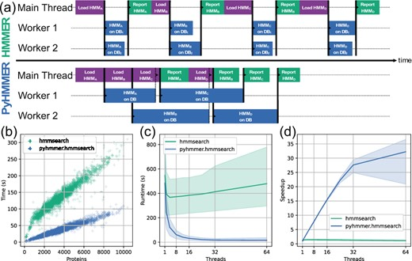

# PyKofamSearch
Fast implementation of [`KofamScan`](https://github.com/takaram/kofam_scan) optimized for high-memory systems using [`PyHmmer`](https://github.com/althonos/pyhmmer).  `PyKofamSearch` can handle fasta in uncompressed or gzip format and databases in either HMM or Python pickle serialized format.  No intermediate files are created. 

### Installation:

```
pip install pykofamsearch
``` 

### Dependencies: 

* pyhmmer >=0.10.12
* pandas
* tqdm


### Benchmarking

| Database      | Tool          | Single Threaded | 12 Threads |
|---------------|---------------|-----------------|------------|
| Full Database | PyKofamSearch | 21:34           | 2:45       |
|               | KofamScan     | 21:53           | 3:40       |
| Enzymes       | PyKofamSearch | 7:39            | 0:56       |

\* Time in minutes for 4977 proteins in `test/test.faa.gz`.  

Official benchmarking for `hmmsearch` algorithm implemented in `PyHMMER`  against `HMMER` from [Larralde et al. 2023](https://academic.oup.com/bioinformatics/article/39/5/btad214/7131068): 




### Usage:
Recommended usage for `PyKofamSearch` is on systems with 1) high RAM;  2) large numbers of threads; and/or 3) reading/writing to disk is charged (e.g., AWS EFS).  Also useful when querying a large number of proteins. 

* #### Using the official KOfam database files:

    ```bash
    # Download database
    DATABASE_DIRECTORY=/path/to/database_directory/
    mkdir -p ${DATABASE_DIRECTORY}/Annotate/KOFAM/
    wget -v -O - ftp://ftp.genome.jp/pub/db/kofam/ko_list.gz | gzip -d > ${DATABASE_DIRECTORY}/Annotate/KOFAM/ko_list
    wget -v -c ftp://ftp.genome.jp/pub/db/kofam/profiles.tar.gz -O - |  tar -xz
    mv profiles ${DATABASE_DIRECTORY}/Annotate/KOFAM/

    # Run PyKofamSearch
    pykofamsearch -i test/test.faa.gz  -o output.tsv -d ${DATABASE_DIRECTORY}/Annotate/KOFAM -p=-1
    ```

* #### Build a serialized database:

    ```bash
    serialize_kofam_models -d path/to/profiles/ -k path/to/ko_list -b path/to/database.pkl.gz
    ```

* #### Using the serialized database files:

    Database can be uncompressed pickle or gzipped pickle. 

    ```bash
    # Full database
    pykofamsearch -i test/test.faa.gz  -o output.tsv -b ~/Databases/KOFAM/database.pkl.gz -p=-1

    # Enzymes only
    pykofamsearch -i test/test.faa.gz  -o output.enzymes.tsv -b ~/Databases/KOFAM/database.enzymes.pkl.gz -p=-1
    ```


* #### Grouping hits by query protein:

    ```bash
    reformat_pykofamsearch -i pykofamsearch_output.tsv -o pykofamsearch_output.reformatted.tsv
    ```

#### Options:

```
$ pykofamsearch -h
usage: pykofamsearch -i <proteins.fasta> -o <output.tsv> -d

    Running: pykofamsearch v2024.4.18 via Python v3.10.14 | /Users/jolespin/miniconda3/envs/kofamscan_env/bin/python3.10

options:
-h, --help            show this help message and exit

I/O arguments:
-i PROTEINS, --proteins PROTEINS
                        path/to/proteins.fasta. stdin does not stream and loads everything into memory. [Default: stdin]
-o OUTPUT, --output OUTPUT
                        path/to/output.tsv [Default: stdout]
--no_header           No header

Utility arguments:
-p N_JOBS, --n_jobs N_JOBS
                        Number of threads to use [Default: 1]

HMMSearch arguments:
-e EVALUE, --evalue EVALUE
                        E-value threshold [Default: 0.1]
-a, --all_hits        Return all hits and do not use curated threshold. Not recommended for large queries.

Database arguments:
-d DATABASE_DIRECTORY, --database_directory DATABASE_DIRECTORY
                        path/to/kofam_database_directory/ cannot be used with -b/-serialized_database
-b SERIALIZED_DATABASE, --serialized_database SERIALIZED_DATABASE
                        path/to/database.pkl cannot be used with -d/--database_directory
```


#### Outputs:

* From **pykofamsearch**:

    | id_protein                 | id_ko  | threshold | score     | e-value      | definition                                                 |
    |----------------------------|--------|-----------|-----------|--------------|------------------------------------------------------------|
    | SRR13615825__k127_135326_1 | K00012 | 377.73    | 6.245e+02 | 7.34282e-188 | UDPglucose 6-dehydrogenase [EC:1.1.1.22]                   |
    | SRR13615825__k127_87070_1  | K00012 | 377.73    | 4.751e+02 | 1.15847e-142 | UDPglucose 6-dehydrogenase [EC:1.1.1.22]                   |
    | SRR13615825__k127_278295_3 | K00020 | 348.7     | 3.639e+02 | 5.39377e-109 | 3-hydroxyisobutyrate dehydrogenase [EC:1.1.1.31]           |
    | SRR13615825__k127_23043_1  | K00033 | 157.6     | 3.598e+02 | 8.14325e-108 | 6-phosphogluconate dehydrogenase [EC:1.1.1.44 1.1.1.343]   |
    | SRR13615825__k127_278295_3 | K00042 | 389.27    | 3.941e+02 | 2.58098e-118 | 2-hydroxy-3-oxopropionate reductase [EC:1.1.1.60]          |

* From **reformat_pykofamsearch**:

    | id_protein                 | number_of_hits | ids                  | names                                                                                                     | evalues                      | scores                                                     |
    |----------------------------|----------------|----------------------|-----------------------------------------------------------------------------------------------------------|------------------------------|------------------------------------------------------------|
    | SRR13615825__k127_135326_1 | 1              | ['K00012']           | ['UDPglucose 6-dehydrogenase [EC:1.1.1.22]']                                                              | [7.34282e-188]               | [624.5]                                                    |
    | SRR13615825__k127_87070_1  | 1              | ['K00012']           | ['UDPglucose 6-dehydrogenase [EC:1.1.1.22]']                                                              | [1.15847e-142]               | [475.1]                                                    |
    | SRR13615825__k127_278295_3 | 2              | ['K00020', 'K00042'] | ['3-hydroxyisobutyrate dehydrogenase [EC:1.1.1.31]', '2-hydroxy-3-oxopropionate reductase [EC:1.1.1.60]'] | [5.39377e-109, 2.58098e-118] | [363.9, 394.1]                                             |
    | SRR13615825__k127_23043_1  | 1              | ['K00033']           | ['6-phosphogluconate dehydrogenase [EC:1.1.1.44 1.1.1.343]']                                              | [8.14325e-108]               | [359.8]                                                    |
    | SRR13615825__k127_72951_1  | 1              | ['K00053']           | ['ketol-acid reductoisomerase [EC:1.1.1.86]']                                                             | [1.54591e-108]               | [362.2]                                                    |

* From **reformat_pykofamsearch** with **-b/--best_hits_only**:

    | id_protein                 | id     | name                                                     | evalue       | score |
    |----------------------------|--------|----------------------------------------------------------|--------------|-------|
    | SRR13615825__k127_135326_1 | K00012 | UDPglucose 6-dehydrogenase [EC:1.1.1.22]                 | 7.34282e-188 | 624.5 |
    | SRR13615825__k127_87070_1  | K00012 | UDPglucose 6-dehydrogenase [EC:1.1.1.22]                 | 1.15847e-142 | 475.1 |
    | SRR13615825__k127_278295_3 | K00042 | 2-hydroxy-3-oxopropionate reductase [EC:1.1.1.60]        | 2.58098e-118 | 394.1 |
    | SRR13615825__k127_23043_1  | K00033 | 6-phosphogluconate dehydrogenase [EC:1.1.1.44 1.1.1.343] | 8.14325e-108 | 359.8 |
    | SRR13615825__k127_72951_1  | K00053 | ketol-acid reductoisomerase [EC:1.1.1.86]                | 1.54591e-108 | 362.2 |


#### If you use this tool, please cite the following sources: 

* Aramaki T, Blanc-Mathieu R, Endo H, Ohkubo K, Kanehisa M, Goto S, Ogata H. KofamKOALA: KEGG Ortholog assignment based on profile HMM and adaptive score threshold. Bioinformatics. 2020 Apr 1;36(7):2251-2252. doi: 10.1093/bioinformatics/btz859. PMID: 31742321; PMCID: PMC7141845.

* Eddy SR. Accelerated Profile HMM Searches. PLoS Comput Biol. 2011 Oct;7(10):e1002195. doi: 10.1371/journal.pcbi.1002195. Epub 2011 Oct 20. PMID: 22039361; PMCID: PMC3197634.

* Larralde M, Zeller G. PyHMMER: a Python library binding to HMMER for efficient sequence analysis. Bioinformatics. 2023 May 4;39(5):btad214. doi: 10.1093/bioinformatics/btad214. PMID: 37074928; PMCID: PMC10159651.

#### Notes:
`PyKofamSearch` output is *slightly* different than `KofamScan`.  For example, in the test case the number of significant hits from `KofamScan` is 1188 while `PyKofamSearch` is 1190.  All hits in from `KofamScan` are in `PyKofamSearch` output.

#### License:

The code for `PyKofamSearch` is licensed under an MIT License

Please contact jolespin@newatlantis.io regarding any licensing concerns.
